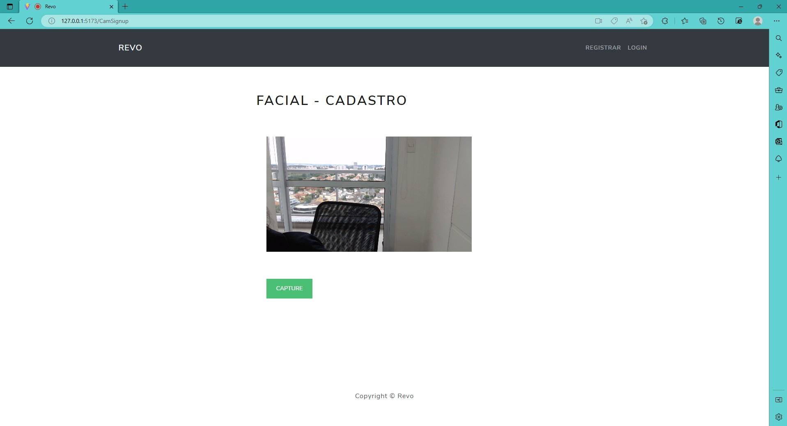

<h1 align="center"> Front-end - Login and Register with Webcam  </h1>

<p align="center">
   Login and Registration Form Front-end opening Webcam for facial recognition.
</p>

<p align="center">
  <a href="#-technologies">Technologies</a>&nbsp;&nbsp;&nbsp;|&nbsp;&nbsp;&nbsp;
  <a href="#-project">Project</a>&nbsp;&nbsp;&nbsp;|&nbsp;&nbsp;&nbsp;
  <a href="#-references">References</a>&nbsp;&nbsp;&nbsp;|&nbsp;&nbsp;&nbsp;
  <a href="#memo-licence">Licence</a>
</p>

<p align="center">
  
</p>

<br>

## Template

<p align="center">
    
    
    
</p>
<p align="center">
    
    
</p>

## 🚀 Technologies

This project was developed with the following technologies:

- [Vite](https://vitejs.dev/) framework TypeScript starter repository.
- [Typescript](https://www.typescriptlang.org/)

## 💻 Project

Project - Login and Registration Form Front-end opening the webcam for facial recognition built with typescript.

## When I create
```bash
npm create vite@latest
```

## Installation

```bash
$ npm install
```

## Running the app

```bash
# development
$ npm run dev
```

Links Usefull:
<p align="left"> VSCode Download -  https://code.visualstudio.com/download</p>
<p align="left"> Git Download -  https://git-scm.com/download/win</p>

## 🔖 References

Vite Guide
https://vitejs.dev/guide/

## :memo: Licence

This project is under the MIT license.

---

Made with ♥ by Karoline :wave: [Let's program together!](https://www.linkedin.com/in/karoline-hikari-yamamoto/)


